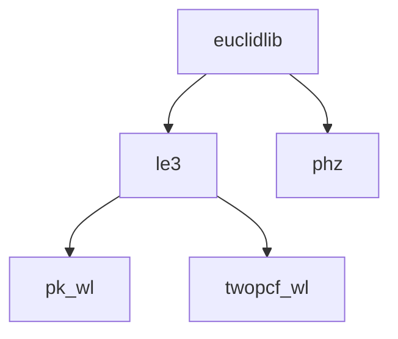

# euclidlib

[](https://pypi.org/project/euclidlib/)
[](https://github.com/euclidlib/euclidlib/actions/workflows/tests.yml)
[](https://pre-commit.com/)
[](https://docs.pytest.org/)
[](https://docs.astral.sh/ruff/)
[](https://prettier.io/)
[](https://mypy.readthedocs.io/)
[](#contributors)

## Table of Contents

- [Introduction](#introduction)
- [Installation](#installation)
- [Contributing](#contributing)
- [License](#license)
- [Contributors](#contributors)

## Introduction

`euclidlib` is an unofficial Python package designed to access official Euclid mission products provided by the Science Ground Segment. Its goal is to offer the Euclid community a user-friendly, ready-to-use library that enables immediate work with science-ready Euclid data.

The package is maintained on a best-effort basis by volunteers and contributors within the Euclid community. See the contributor list below.

## Installation

As simple as:

```sh
pip install euclidlib
```

### Prerequisites

- `python>3.7`
- `fitsio`
- `numpy`

## Structure and Format of `euclidlib`

The design of the `euclidlib` package closely follows the organisation of the [Euclid Data Product Description Documentation](http://st-dm.pages.euclid-sgs.uk/data-product-doc/dm10/) and reflects the structure of the Euclid Science Ground Segment.



`euclidlib` provides all data products in a unified, Pythonic format based on dataclasses, ensuring consistent, intuitive, and easy-to-use interfaces across all supported products. Please consult the full documentation for additional details.

## Contributing

If you would like to contribute, follow the following steps:

1. Open an issue to let the `euclidlib` maintainers know about your contribution plans (new Euclid product? New feature? A suggestion?)
2. Create a new branch:
   ```sh
   git checkout -b feature/your-feature-name
   ```
3. Commit your changes:
   ```sh
   git commit -m 'Add some feature'
   ```
4. Push to the branch:
   ```sh
   git push origin feature/your-feature-name
   ```
5. Open a pull request

## License

This project is licensed under the MIT License - see the [LICENSE](LICENSE) file for details.

## Contributors

This project follows the [all-contributors](https://github.com/all-contributors/all-contributors) specification. Contributions of any kind are welcome!

To discover the meaning of each icon, hover your mouse over it.

<!-- ALL-CONTRIBUTORS-LIST:START - Do not remove or modify this section -->
<!-- prettier-ignore-start -->
<!-- markdownlint-disable -->
<table>
  <tbody>
    <tr>
      <td align="center" valign="top" width="14.28%"><a href="http://gcanasherrera.com"><br /><sub><b>Guadalupe Cañas-Herrera</b></sub></a><br /><a href="#code-gcanasherrera" title="Code">💻</a> <a href="#review-gcanasherrera" title="Reviewed Pull Requests">👀</a> <a href="#ideas-gcanasherrera" title="Ideas, Planning, & Feedback">🤔</a> <a href="#maintenance-gcanasherrera" title="Maintenance">🚧</a> <a href="#test-gcanasherrera" title="Tests">⚠️</a> <a href="#example-gcanasherrera" title="Examples">💡</a></td>
      <td align="center" valign="top" width="14.28%"><a href="http://ntessore.page"><br /><sub><b>Nicolas Tessore</b></sub></a><br /><a href="#code-ntessore" title="Code">💻</a> <a href="#review-ntessore" title="Reviewed Pull Requests">👀</a> <a href="#ideas-ntessore" title="Ideas, Planning, & Feedback">🤔</a> <a href="#example-ntessore" title="Examples">💡</a> <a href="#maintenance-ntessore" title="Maintenance">🚧</a> <a href="#test-ntessore" title="Tests">⚠️</a></td>
      <td align="center" valign="top" width="14.28%"><a href="https://github.com/zahrabaghkhani"><br /><sub><b>Zahra Baghkhani</b></sub></a><br /><a href="#code-zahrabaghkhani" title="Code">💻</a></td>
      <td align="center" valign="top" width="14.28%"><a href="https://jaimeruizzapatero.net/"><br /><sub><b>Jaime RZ</b></sub></a><br /><a href="#review-JaimeRZP" title="Reviewed Pull Requests">👀</a> <a href="#ideas-JaimeRZP" title="Ideas, Planning, & Feedback">🤔</a></td>
      <td align="center" valign="top" width="14.28%"><a href="https://github.com/itutusaus"><br /><sub><b>itutusaus</b></sub></a><br /><a href="#review-itutusaus" title="Reviewed Pull Requests">👀</a></td>
      <td align="center" valign="top" width="14.28%"><a href="https://github.com/FelicitasKeil"><br /><sub><b>Felicitas Keil</b></sub></a><br /><a href="#code-FelicitasKeil" title="Code">💻</a></td>
      <td align="center" valign="top" width="14.28%"><a href="https://github.com/WillHartley"><br /><sub><b>WillHartley</b></sub></a><br /><a href="#ideas-WillHartley" title="Ideas, Planning, & Feedback">🤔</a> <a href="#data-WillHartley" title="Data">🔣</a></td>
    </tr>
    <tr>
      <td align="center" valign="top" width="14.28%"><a href="https://github.com/FlorianDubath"><br /><sub><b>FlorianDubath</b></sub></a><br /><a href="#ideas-FlorianDubath" title="Ideas, Planning, & Feedback">🤔</a> <a href="#data-FlorianDubath" title="Data">🔣</a></td>
      <td align="center" valign="top" width="14.28%"><a href="https://github.com/jacopo-salvalaggio"><br /><sub><b>Jacopo Salvalaggio</b></sub></a><br /><a href="#code-jacopo-salvalaggio" title="Code">💻</a> <a href="#ideas-jacopo-salvalaggio" title="Ideas, Planning, & Feedback">🤔</a> <a href="#data-jacopo-salvalaggio" title="Data">🔣</a></td>
    </tr>
  </tbody>
</table>

<!-- markdownlint-restore -->
<!-- prettier-ignore-end -->

<!-- ALL-CONTRIBUTORS-LIST:END -->
